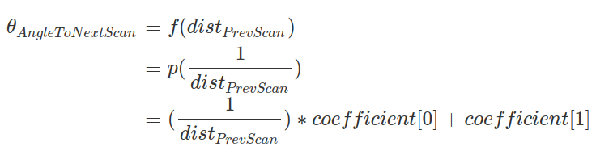

# VL53L1X Scanner Code Documentation


## 1. Adaptive Methods

### 1.1 Adaptive Scan Resolution

Optimizes angle between scans based on the previous single measurement. 

**Pros:**

- Is good for real-time operations (i.e. localization)
- Gives results faster
- Gives less data but with similar information

**Cons:**

- Outputs PointCloud2. Needs resampling for LaserScan message.
- May miss some measurements on edges of an object.

**Math:**

(1) Finding theta. Assuming that two scans will have same measurements. Applying cosines theorem.


(2) In boundaries of the hardwares, `theta = f(dist)` has **reciprocal distribution** features. After removing the effect of this property, applying line fitting to find coefficients. See `/scripts/adaptive_scan_resolution_find_coefficients.py`



(3) Line fitting result of `theta = p(1/dist)`


TODO:

```c
//float coef[2] = {0.03036822, -0.00032111}; // 3cm
//float coef[2] = {1.00130428e-02, -1.13428036e-05}; // 1cm
float coef[2] = {0.05189296, -0.00166131}; // 5cm
float distance = (float(last_scan_range_millimeter)/1000.0);
float adaptive_angle = (1.0/distance)*coef[0] + coef[1];
float step_per_angle = 325.949278381;
float target_step = adaptive_angle * step_per_angle;
if (abs(int(target_step)) <= 0)
  target_step = 1;
target_step = abs(int(target_step)) * scanner_direction;
stepperStep(target_step, stepper_delay);
//stepperStep(scanner_direction*scanner_horizontal_steps_per_scan, stepper_delay);
scan();
Serial.print("# target_step ");
Serial.println(target_step);
```


## 5. Notes

- Stepper motor delay set as 2.25ms instead of 2ms, because it was missing steps.
- Stepper motor phase set as 1 instead of 2, because torque was enough.
- (TODO) 28BYJ-48 steps per revolution is 2048 instead of 2038.

- Math calculation for measurement to pointcloud conversion:


- Intensity value is equal to `signal_rate` (This may change in the future)


TODO:

- 3d best quality/speed parameters
- 2d best quality/speed parameters
- 2d select scan ring configuration


