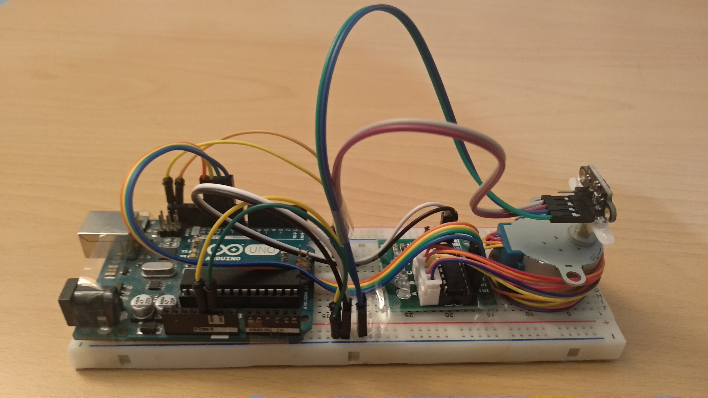

# VL53L1X Scanner (UNDER CONSTRUCTION!)

   * [VL53L1X Scanner (UNDER CONSTRUCTION!)](#vl53l1x-scanner-under-construction)
      * [1. Introduction](#1-introduction)
      * [2. Making the Scanner](#2-making-the-scanner)
      * [3. Installing the Software](#3-installing-the-software)
      * [4. Running](#4-running)
      * [5. Notes](#5-notes)
      * [6. References](#6-references)

## 1. Introduction

This is my DIY laser scanner project that I designed in quarantine days of covid-19.  

**Features:**

- ROS Drivers
- 2D and 3D scanning mode
- (TODO) Laser parameters adaptive mode
- Resets stepper motor position when the driver is stopped
- (TODO) Bag files


## 2. Making the Scanner

Materials should be placed on to the breadboard and connections should be made as it is shown in the pictures below:

**Requirements:**

- VL53L1X  ToF Laser Distance Sensor
- 28BYJ-48 Stepper Motor (with its driver)
- A header for stepper motor (I used servo motor header)
- Arduino UNO
- Breadboard & Jumper Cables
- Hot glue & Adhesive Tape
- PC and USB Cable for Arduino (Will be used in the next section)

**Connection Diagram:**

[TODO CONNECTION DIAGRAM]

- Stepper motor driver IN1 -> 9

- Stepper motor driver IN1 -> 10

- Stepper motor driver IN1 -> 11

- Stepper motor driver IN1 -> 12

**Result:**




## 3. Installing the Software

**Requirements:**

- Ubuntu 18.04 & ROS Melodic

- Arduino IDE 1.8.12
- VL53L1X API (https://www.st.com/en/embedded-software/stsw-img007.html)

**Installing:**

- Clone the project into `catkin_ws`:

```bash
$ mkdir -p ~/catkin_ws/src
$ cd ~/catkin_ws/src
$ git clone https://github.com/salihmarangoz/vl53l1x_scanner.git
```

- Compile the project:

```bash
$ cd ~/catkin_ws
$ catkin_make # or "catkin build"
```

- Extract the API folder (`vl53l1_api`) into `~/Arduino/libraries/` (Link in the requirements section)
- Upload the Arduino code using Arduino IDE: `~/catkin_ws/src/vl53l1x_scanner/arduino_code/vl53l1x_scanner_arduino/vl53l1x_scanner_arduino.ino`


## 4. Running

- Before running the systems, calibration process must be done:

```
TODO: CALIBRATION NODE
IF YOU WANT TO CALIBRATE, CONNECT TO THE DEVICE WITH SERIAL MONITOR OF ARDUINO SOFTWARE WITH 9600 BAUD RATE. THEN TYPE "C {STEPS}". FOR EXAMPLE: "C +100" or "C -100". AFTER CLODING SERIAL MONITOR YOU CAN CONTINUE.
```

- Run the scanner driver:

```bash
$ source ~/catkin_ws/devel/setup.bash

# TO START THE DRIVER SELECT ONE:
$ roslaunch vl53l1x_scanner start_2d.launch
$ roslaunch vl53l1x_scanner start_3d.launch

# OR;

# TO INVESTIGATE PRE-RECORDED BAGS SELECT ONE:
$ roslaunch vl53l1x_scanner bag_2d.launch
$ roslaunch vl53l1x_scanner bag_3d.launch
```

- Run RViz:

```bash
$ roslaunch vl53l1x_scanner rviz.launch
```


## 5. Notes

- Set stepper motor delay as 2.25ms instead of 2ms, because it was missing steps.
- Set stepper motor phase 1 instead of 2, because torque was enough.
- (TODO) 28BYJ-48 steps per revolution is 2048 instead of 2038.

- Math calculation for measurement to pointcloud conversion:

$$
\begin{pmatrix}
x\\
y\\
z
\end{pmatrix} = \begin{pmatrix}
d_{laser} * cos(\theta_{vertical})  cos(\theta_{horizontal}) \\
d_{laser} * cos(\theta_{vertical})  sin(\theta_{horizontal})\\
d_{laser} * sin(\theta_{vertical})
\end{pmatrix}
$$


## 6. References

- Stepper Driver: http://eeshop.unl.edu/pdf/Stepper+Driver.pdf
- VL53L1X ROI Documentation: https://www.st.com/resource/en/application_note/dm00516219-using-the-programmable-region-of-interest-roi-with-the-vl53l1x-stmicroelectronics.pdf

