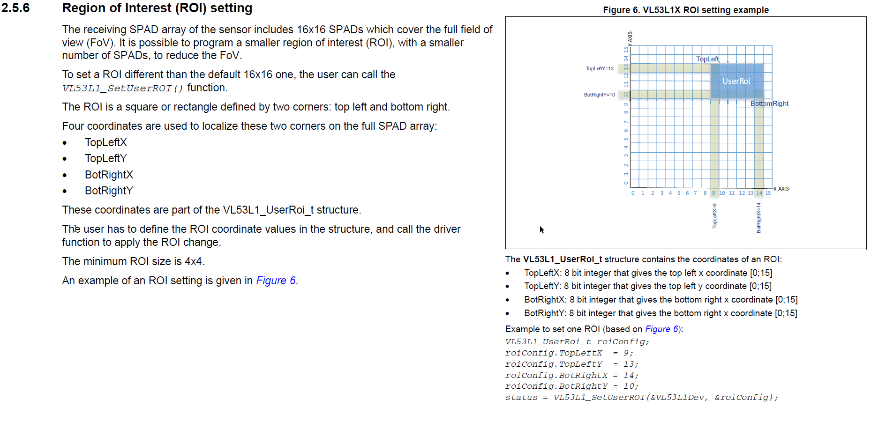

# VL53L1X LiDAR

## ToDo

- 28BYJ-48 exact steps per revolution? 2048?
- Is using 1 phase instead of 2 phase good?
- Using 2.25ms instead of 2ms?
- Maybe we can set RoI vertically longer in 2D mode?
- Laser adaptive mode?

## Hardwares:

- VL53L1X  ToF Laser Distance Sensor
- 28BYJ-48 Stepper Motor

## Required Libraries

- https://www.st.com/en/embedded-software/stsw-img007.html#get-software

## References

- http://eeshop.unl.edu/pdf/Stepper+Driver.pdf
- https://www.st.com/resource/en/application_note/dm00516219-using-the-programmable-region-of-interest-roi-with-the-vl53l1x-stmicroelectronics.pdf

