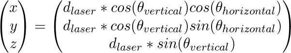

# VL53L1X Scanner (UNDER CONSTRUCTION!)

   * [VL53L1X Scanner (UNDER CONSTRUCTION!)](#vl53l1x-scanner-under-construction)
      * [1. Introduction](#1-introduction)
      * [2. Making the Scanner](#2-making-the-scanner)
      * [3. Installing the Software](#3-installing-the-software)
      * [4. Running](#4-running)
      * [5. Notes](#5-notes)
      * [6. References](#6-references)

## Support me on Patreon

[](https://www.patreon.com/bePatron?u=33807246)


## 1. Introduction

This is my DIY laser scanner project that I designed in quarantine days of covid-19.  I aim to demonstrate the capabilities of VL53L1X range finder sensor and design a 2D/3D scanner and depth camera.

**Features:**

- ROS Driver
- 2D and 3D scanning mode (~1500 in horizontal ~270 deg fov / 13 in vertical ~27 deg fov)
- (TODO) Depth camera mode
- Resets stepper motor position to 0 when the driver is terminated
- (TODO) Adaptive parameters (Smart Measurement)
  
  - Adaptive Signal Power
    - (TODO) Adaptive laser measurement timing (based on sig1, sig2, measurement)
    - (TODO) Adaptive RoI height (or width) (based on sig1, sig2 measurement)
  
  - Adaptive Resolution
    - (TODO) Adaptive stepper resolution based on measurement
    - (TODO) Adaptive measurement mode (based on sig1, sig2 , measurement)
    - (TODO) Sampling missing data caused by adaptive resolution
- (TODO) Bag files
- (TODO FOR ANOTHER PROJECT) Deep Learning based scan noise reduction
  - fullscan based and/or single measurement based
  - dataset_X: measurements with fast parameters
  - dataset_Y: measurements with accurate parameters
- (TODO) Stepper One Phase/Two Phase Mode
- (TODO) Stepper Half Step Mode


## 2. Making the Scanner

Materials should be placed on to the breadboard and connections should be made as it is shown in the pictures below:

**Requirements:**

- VL53L1X  ToF Laser Distance Sensor
- 28BYJ-48 Stepper Motor and its driver board (ULN2003APG)
- A header for stepper motor (I used servo motor header)
- Arduino UNO
- Breadboard & Jumper Cables
- Hot glue & Adhesive Tape
- PC and USB Cable for Arduino (Will be used in `Installing the Software` section)

**Connection Diagram:**

- (Blue) `Arduino D9` **<=>** `Stepper motor driver IN1`
- (Blue) `Arduino D10` **<=>** `Stepper motor driver IN2`
- (Blue) `Arduino D11` **<=>** `Stepper motor driver IN3`
- (Blue) `Arduino D12` **<=>** `Stepper motor driver IN4`
- (Cyan) `Arduino SDA` **<=>** `VL53L1X SDA`
- (Cyan) `Arduino SCL` **<=>** `VL53L1X SCL`
- (Red) `Arduino 5V` **<=>** `Stepper Motor Driver 5V` **<=>** `VL53L1X VIN`
- (Black) `Arduino GND` **<=>** `Stepper Motor Driver GND` **<=>** `VL53L1X GND`
- (Colorful) `Stepper Motor Driver` **<=>** `Stepper Motor`


**Result:**


## 3. Installing the Software

**Requirements:**

- Ubuntu 18.04 & ROS Melodic

- Arduino IDE 1.8.12
- VL53L1X API (https://www.st.com/en/embedded-software/stsw-img007.html#get-software)

**Installing:**

- Add user to dialout group then restart the PC:

```bash
$ sudo adduser $USER dialout
```

- Clone the project into `catkin_ws`:

```bash
$ mkdir -p ~/catkin_ws/src
$ cd ~/catkin_ws/src
$ git clone https://github.com/salihmarangoz/vl53l1x_scanner.git
```

- Compile the project:

```bash
$ cd ~/catkin_ws
$ catkin_make # or "catkin build"
```

- Extract the API folder (`vl53l1_api`) into `~/Arduino/libraries/` (Link in the requirements section)
- Upload the Arduino code using Arduino IDE: `~/catkin_ws/src/vl53l1x_scanner/arduino_code/vl53l1x_scanner_arduino/vl53l1x_scanner_arduino.ino`


## 4. Running

- Before running the systems, calibration process must be done if the laser is not faced forward:

```bash
$ cd ~/catkin_ws/src/vl53l1x_scanner/script/
# Positive for counter-clockwise or negative for clockwise rotation.
# The value "+100" is an example for positive rotation. Try "-100".
# As a result, laser should be facing forward.
# NOTE: May not work at the first try.
$ ./calibrate.sh /dev/ttyACM0 +100   
```

- Run the scanner driver:

```bash
$ source ~/catkin_ws/devel/setup.bash

# TO START THE DRIVER SELECT ONE:
$ roslaunch vl53l1x_scanner start_2d.launch
$ roslaunch vl53l1x_scanner start_3d.launch

# OR;

# TO INVESTIGATE PRE-RECORDED BAGS SELECT ONE:
$ roslaunch vl53l1x_scanner bag_2d.launch
$ roslaunch vl53l1x_scanner bag_3d.launch
```

- Run RViz:

```bash
$ roslaunch vl53l1x_scanner rviz.launch
```


## 5. Notes

- Stepper motor delay set as 2.25ms instead of 2ms, because it was missing steps.
- Stepper motor phase set as 1 instead of 2, because torque was enough.
- (TODO) 28BYJ-48 steps per revolution is 2048 instead of 2038.

- Math calculation for measurement to pointcloud conversion:



- Intensity value is equal to `signal_rate` (This may change in the future)


## 6. References

- Stepper Driver Documentation: http://eeshop.unl.edu/pdf/Stepper+Driver.pdf
- VL53L1X ROI Documentation: https://www.st.com/resource/en/application_note/dm00516219-using-the-programmable-region-of-interest-roi-with-the-vl53l1x-stmicroelectronics.pdf
- Stepper and its Driver Fritzing Files: https://github.com/e-radionicacom/e-radionica.com-Fritzing-Library-parts-

